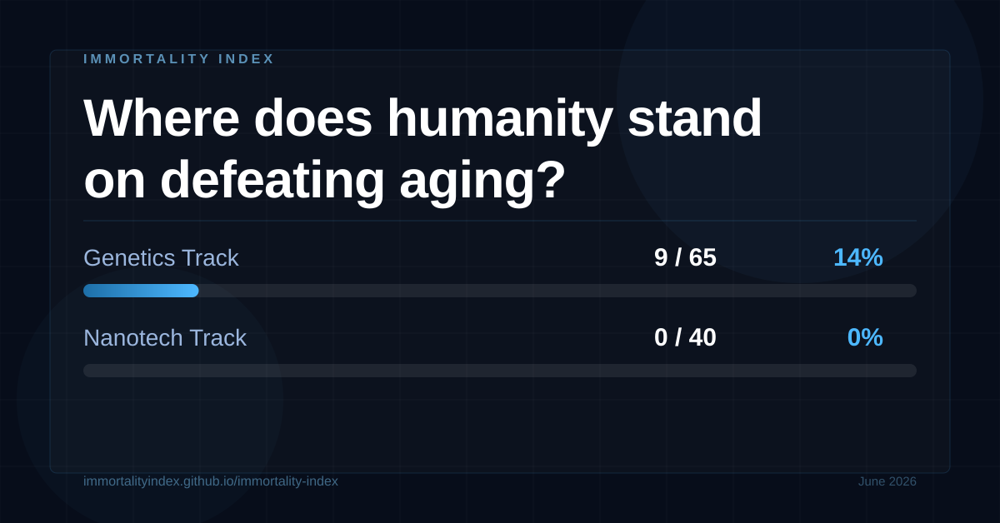

# Tweet Archive

Auto-generated log of Immortality Index tweets.

---

## June 20, 2026 — State of play


**Biological aging is not a mystery — it is a set of solvable engineering problems.**

```
Biological aging is not a mystery — it is a set of solvable engineering problems.

We track the field's progress against 26 mechanistic obstacles, using binary milestones grounded in peer-reviewed evidence.

Genetics Track:  9/65 milestones confirmed (14%)
Nanotech Track:  0/40 milestones confirmed (0%)

No hype. No speculation. Just the science, in real time.

#Longevity #Geroscience #AgingResearch #OpenScience

https://immortalityindex.github.io/immortality-index
```

---
## June 20, 2026 — State of play


**Biological aging is not a mystery — it is a set of solvable engineering problems.**

```
Biological aging is not a mystery — it is a set of solvable engineering problems.

We track the field's progress against 26 mechanistic obstacles, using binary milestones grounded in peer-reviewed evidence.

Genetics Track:  9/65 milestones confirmed (14%)
Nanotech Track:  0/40 milestones confirmed (0%)

No hype. No speculation. Just the science, in real time.

#Longevity #Geroscience #AgingResearch #OpenScience

https://immortalityindex.github.io/immortality-index
```

---
## June 20, 2026 — State of play



**Biological aging is not a mystery — it is a set of solvable engineering problems.**

```
Biological aging is not a mystery — it is a set of solvable engineering problems.

We track the field's progress against 26 mechanistic obstacles, using binary milestones grounded in peer-reviewed evidence.

Genetics Track:  9/65 milestones confirmed (14%)
Nanotech Track:  0/40 milestones confirmed (0%)

No hype. No speculation. Just the science, in real time.

#Longevity #Geroscience #AgingResearch #OpenScience

https://immortalityindex.github.io/immortality-index
```

---
